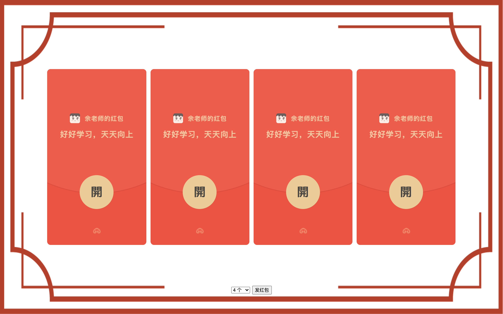
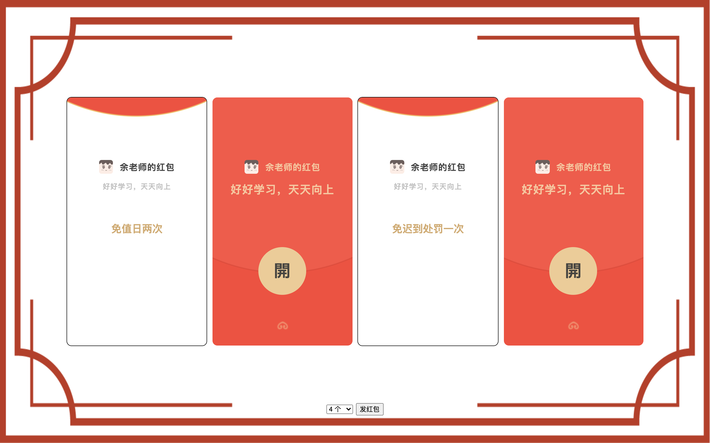
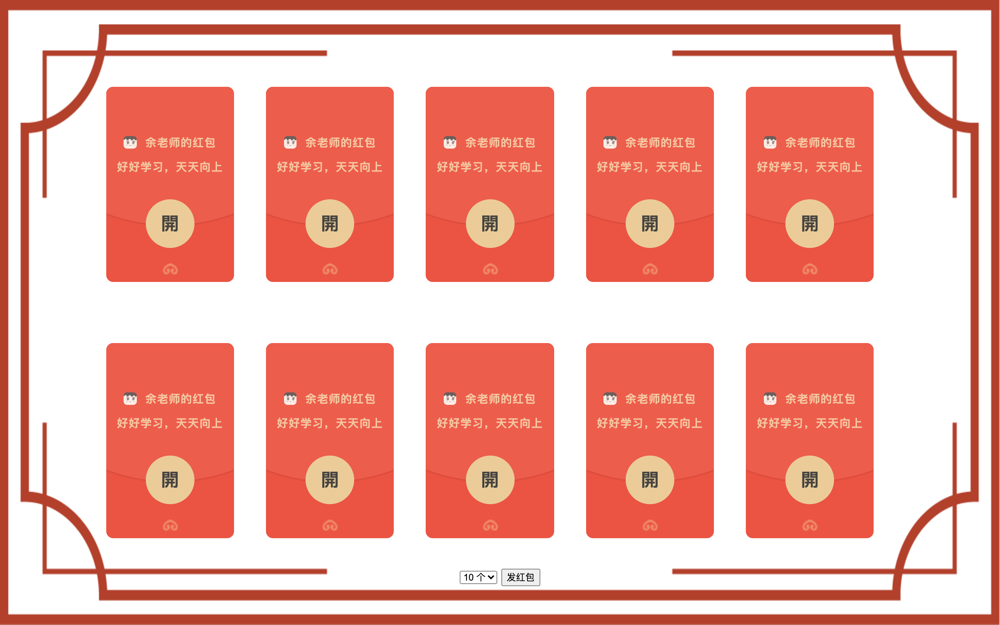
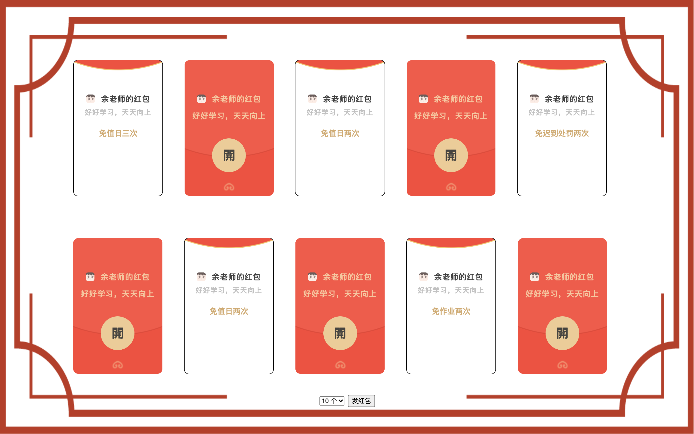

# red-package

#### 介绍
纯前端，可配置红包抽奖程序

#### 使用说明
1. 安装 Chrome 谷歌浏览器
2. 解压文件
3. 配置信息在解压后的：config.js 中
4. 用 Chrome 浏览器打开：welcome.html 进入「欢迎页」
5. 点击「欢迎页」任意地方进入「红包页」

#### 配置介绍：config.js

```javascript
let config = {
    title: '抽红包啦~',
    className:'六年级（1）班',
    name: '余老师',
    awards: [
        // weight：权重，数值越大，中奖概率越高
        // name: 奖项名称
        {weight: 3, name: '免值日一次'},
        {weight: 3, name: '免作业一次'},
        {weight: 3, name: '免迟到处罚一次'},
        {weight: 2, name: '免值日两次'},
        {weight: 2, name: '免作业两次'},
        {weight: 2, name: '免迟到处罚两次'},
        {weight: 1, name: '免值日三次'},
        {weight: 1, name: '免作业三次'},
        {weight: 1, name: '免迟到处罚三次'}
    ]
}
```

#### 效果展示












#### 打赏

> **如果觉得对你有帮助，欢迎扫码打赏**

<div>
   
    
</div>

